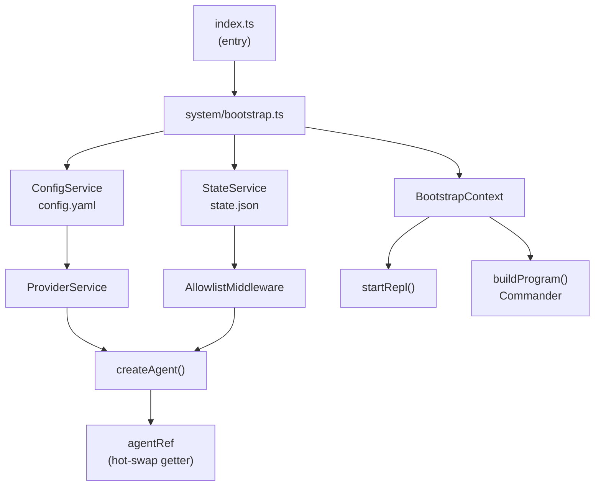
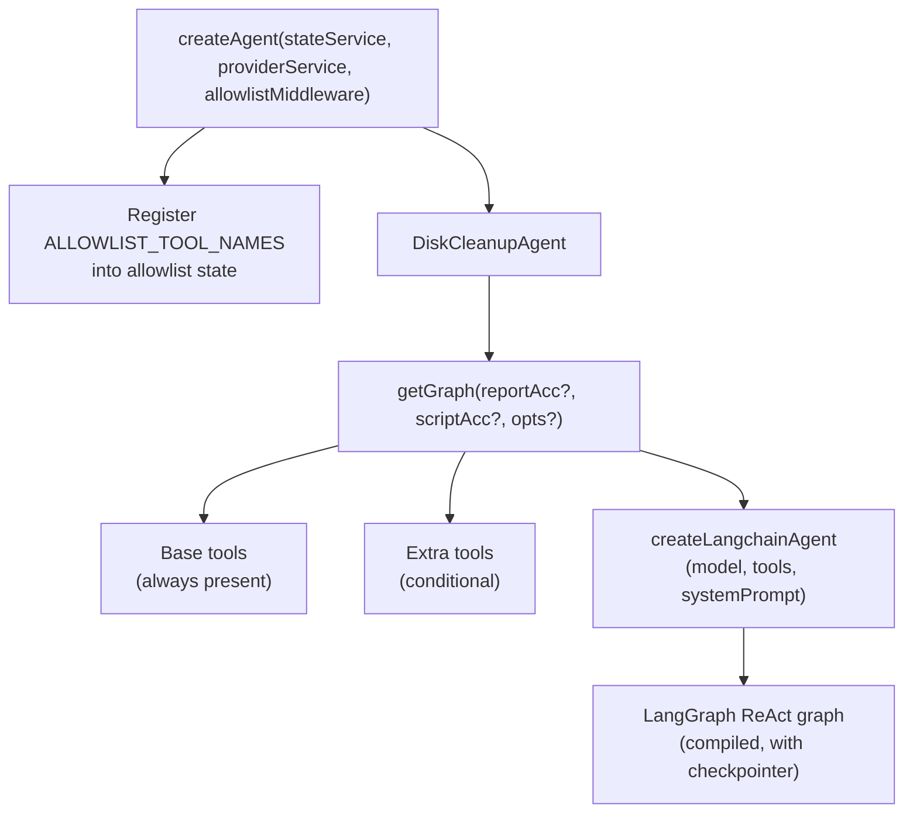
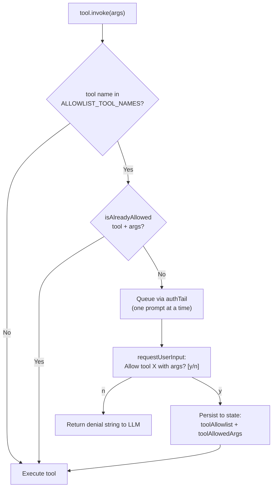
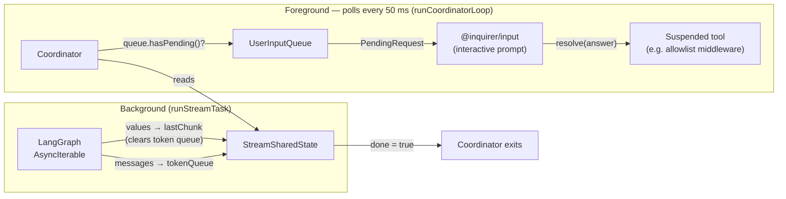
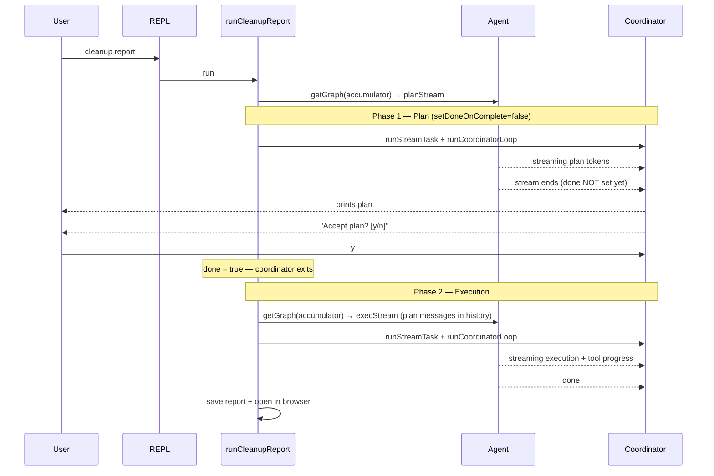

# Architecture

`disk-cleanup` is a LangChain ReAct agent combined with a Commander CLI and interactive REPL. All agent behaviour is driven by pluggable **skills** — Markdown files loaded lazily at runtime — so adding a new capability rarely requires touching agent or tool code.

---

## Directory Layout

```
src/
├── index.ts                  Entry point: loads env, wires signal handlers, calls bootstrap, launches CLI/REPL
├── system/                   Composition root — constructs and wires all services and the agent
│   ├── bootstrap.ts          Assembles all services, creates agent, returns BootstrapContext for the CLI
│   ├── configService.ts      Owns ~/.<appName>/config.yaml (provider definitions)
│   ├── stateService.ts       Owns ~/.<appName>/state.json (runtime prefs, allowlist)
│   ├── types.ts              Shared types and state-key constants (single source of truth)
│   └── index.ts              Public re-exports for the system layer
├── services/
│   └── providerService.ts    Domain logic for adding/listing/deleting LLM providers
├── cli/
│   ├── program.ts            Commander program + REPL help text builder
│   ├── repl.ts               Interactive REPL loop (readline-based)
│   ├── streamDisplay.ts      Streaming coordinator and single-line terminal display
│   ├── userInputQueue.ts     Async queue that lets tools prompt the user mid-stream
│   ├── addProviderWorkflow.ts Interactive provider-add flow (inquirer)
│   ├── cleanupReport.ts      Two-phase cleanup report workflow (plan → execute)
│   ├── cleanupScript.ts      Cleanup script generation workflow
│   └── cleanupReportView.ts  Report viewer (renders HTML, opens in browser)
└── agent/
    ├── agent.ts              createAgent() — builds the ReAct graph with tools
    ├── allowlistMiddleware.ts Human-in-the-loop tool authorization, persisted per provider
    ├── index.ts              Public re-exports for the agent layer
    ├── skills/
    │   ├── report/SKILL.md   Lazy-loaded instructions for the cleanup report task
    │   └── script/SKILL.md   Lazy-loaded instructions for the cleanup script task
    └── tools/
        ├── index.ts          Barrel — re-exports all tools and wrapWithAllowlist
        ├── wrapWithAllowlist.ts  Decorator that gates tool.invoke behind allowlist check
        ├── getSkill.ts       Reads a SKILL.md file and returns it to the LLM
        ├── getSystemType.ts  Returns "mac" / "windows" / "linux"
        ├── getCurrentUsername.ts Returns the OS username
        ├── listFolders.ts    Lists directory entries (type + permissions)
        ├── listFoldersBatch.ts   Same for multiple paths in one call
        ├── listFolderContentsBySize.ts  Children with recursive size, sorted desc
        ├── changeDirectory.ts   Validates and resolves a path (virtual cd)
        ├── getFolderCapacity.ts    Total recursive size of a single directory
        ├── getFolderCapacityBatch.ts  Same for multiple directories
        ├── commandProbe.ts   Checks which CLI tools (npm, docker, brew…) are installed
        ├── reportCleanupOpportunity.ts  Appends opportunities to a ReportAccumulator
        ├── submitCleanupScript.ts  Writes the finished script via a ScriptAccumulator
        ├── systemPaths.ts    Utility: blocks access to OS root paths
        ├── pathUtils.ts      Utility: tilde expansion
        ├── folderSize.ts     Utility: du-based and sync-walk size helpers
        └── commonOffenders.ts   Static map of common cache paths per platform
```

---

## Bootstrap and Dependency Flow

`src/index.ts` defines a single build-time constant (`APP_NAME`) and delegates everything else to `bootstrap()`. Bootstrap is the **composition root**: it constructs all services, wires them together, and returns a `BootstrapContext` that the CLI consumes. Nothing outside `system/` ever constructs a service directly.



**Bootstrap sequence:**

1. `ConfigService` is created and `loadConfig()` is called — provider definitions are now in memory.
2. `StateService` is created and `load()` is called — runtime state (allowlist, selected provider) is now in memory.
3. `ProviderService` is created with the config service. If no providers exist, `runAddProviderWorkflow` is invoked; if it returns `false` or is absent, the process exits.
4. `UserInputQueue` is created — the bridge between tool prompts and the CLI display loop.
5. `AllowlistMiddleware` is created with the state service. Its `getCurrentProviderId` closure reads `stateService.getState()["selectedProviderId"]` at call time, falling back to the first provider.
6. `createAgent()` is called with `{ stateService, providerService, allowlistMiddleware }`.
7. The agent is stored in an `agentRef` object and exposed via a getter. This lets `recreateAgent()` silently swap the agent after a provider change without the CLI updating any reference.

**Storage locations:**

| File | Purpose |
|---|---|
| `~/.<appName>/config.yaml` | Provider definitions (id, type, api key, optional model override) |
| `~/.<appName>/state.json` | Selected provider, tool allowlist, approved tool arguments |

---

## Agent Architecture

`createAgent()` returns a `DiskCleanupAgent` — a thin wrapper around a LangChain ReAct graph.



**Base tools** (always in the graph):

- `get_system_type`, `get_current_username` — injected raw, no allowlist gate
- All other base tools wrapped via `wrapToolWithAllowlist`

**Extra tools** (injected only when needed):

| Tool | Condition |
|---|---|
| `web_search` | Active provider is OpenAI or Anthropic |
| `report_cleanup_opportunity` | A `ReportAccumulator` is passed to `getGraph` |
| `submit_cleanup_script` | A `ScriptAccumulator` is passed to `getGraph` |

The system prompt instructs the agent to call `get_skill` with the appropriate skill name at the start of every task before doing anything else.

---

## Tool System and Allowlist Middleware

### Tool wrapping

All tools are passed through `wrapToolWithAllowlist(tool, allowlistMiddleware)` at graph-build time (in `agent.ts`). The wrapper checks whether the tool name is in `ALLOWLIST_TOOL_NAMES`. If not (e.g. `get_skill`), the tool is returned unchanged. If yes, `tool.invoke` is overridden to run the authorization check first.

### Authorization flow



**"Already allowed" check** — a call is considered already authorized when:
- The tool name is in the provider's `toolAllowlist` array, and
- Every argument key in the incoming call exists in the stored arg map for that tool, and
- Every argument value (or every element if the value is an array) is present in the stored set for that key.

The `id` argument (a unique LangChain invocation ID) is stripped before any comparison or storage, so re-runs of the same logical call are auto-approved.

Values are canonicalized deterministically before storage: primitives via `JSON.stringify`, objects with sorted keys, arrays element-by-element. This ensures the same semantic call always matches regardless of incidental ordering differences.

**Serialization** — the `authTail` promise chain ensures at most one user prompt is shown at a time, even when the model fires multiple tool calls concurrently.

### Allowlist state structure

`~/.disk-cleanup/state.json`:

```json
{
  "toolAllowlist": {
    "<providerId>": ["list_folders", "command_probe", "get_folder_capacity"]
  },
  "toolAllowedArgs": {
    "<providerId>": {
      "list_folders": {
        "path": ["\"~/Library/Caches\"", "\"~/.npm\""]
      },
      "list_folders_batch": {
        "paths": ["\"~/Library/Caches\""]
      },
      "command_probe": {
        "commands": ["\"npm\"", "\"docker\"", "\"brew\""]
      }
    }
  }
}
```

The allowlist is **scoped per provider ID**. Switching to a different provider starts with a clean authorization history.

### Tool reference

| Tool | Allowlist-gated | Purpose |
|---|---|---|
| `get_system_type` | No | Returns `"mac"`, `"windows"`, or `"linux"` |
| `get_current_username` | No | Returns the OS username |
| `get_skill` | No (pass-through) | Reads a `SKILL.md` file and returns it to the LLM |
| `list_folders` | Yes | Lists directory entries with type and rw permissions; rejects system paths |
| `list_folders_batch` | Yes | Same as above for multiple paths in one call |
| `list_folder_contents_by_size` | Yes | Lists direct children with recursive size, sorted descending |
| `change_directory` | Yes | Validates and resolves a path — virtual `cd`, no real `chdir` |
| `get_folder_capacity` | Yes | Total recursive byte size of a single directory |
| `get_folder_capacity_batch` | Yes | Same for multiple directories, with per-path progress |
| `command_probe` | Yes | Checks if CLI tools (npm, docker, brew…) are installed; only a hardcoded set of commands may be probed |
| `report_cleanup_opportunity` | No (extra tool) | Appends cleanup opportunities to the in-memory `ReportAccumulator` |
| `submit_cleanup_script` | Yes (extra tool) | Writes the finished shell script via the `ScriptAccumulator` |
| `web_search` | No (extra tool) | Domain-filtered web search via provider-native tools |

---

## Streaming Coordinator Pattern

All agent-driven workflows use a two-coroutine model to simultaneously stream the agent's output and handle interactive prompts (e.g. allowlist authorization) without blocking or corrupting the terminal line.

### Shared state

```typescript
interface StreamSharedState {
  lastChunk: { messages: BaseMessage[] } | null;
  toolProgress: string | null;   // set by long-running tools
  streamedTokenQueue: string[];  // LLM token fragments for the current turn
  done: boolean;
  aborted?: boolean;
}
```

This object is the only communication channel between the two coroutines.

### Data flow



**Background task (`runStreamTask`):**
- Consumes the LangGraph `AsyncIterable`.
- Supports two stream modes: `"values"` only (each item is a full graph state snapshot), and `["values", "messages"]` multi-mode (token-level streaming). In multi-mode, LLM token fragments are appended to `streamedTokenQueue`; each `"values"` chunk clears the queue.
- When the stream ends (or SIGINT fires), sets `sharedState.done = true` and clears the terminal line. The `setDoneOnComplete: false` option defers setting `done` so the coordinator stays alive for a follow-up prompt (used in the cleanup report plan phase).

**Foreground coordinator (`runCoordinatorLoop`):**
- Polls every 50 ms while `!done || queue.hasPending()`.
- **If the queue has a pending request:** clears the stream line, shows the `@inquirer/input` prompt, and resolves/rejects the `PendingRequest`. The tool that called `requestInput` was suspended awaiting this promise and is now unblocked.
- **If the queue is empty:** computes the display line (tool progress > streamed tokens > tool name from last message > "Thinking...") and updates the terminal in-place using `\r` + ANSI clear. The line is capped at 400 characters.

**User input queue (`userInputQueue.ts`):**
A lightweight `PendingRequest[]` array. Any code (tools, middleware) calls `queue.requestInput({ message, validate? })` and awaits the returned Promise. The coordinator drains and resolves these requests on each 50 ms tick.

---

## Cleanup Report: Two-Phase Workflow

The cleanup report workflow runs the agent **twice** on the same graph instance, carrying message history forward so the execution phase has full context from the plan.



Key details:
- Phase 1 uses `setDoneOnComplete: false` so the coordinator stays alive after the stream ends. The workflow then enqueues the plan-acceptance prompt via `userInputQueue`, which the still-running coordinator picks up and renders.
- Only after the user answers (and `planSharedState.done` is set to `true`) does the coordinator exit.
- Phase 2 passes the full plan-phase message history to the graph, giving the agent context about what it already planned.
- The `ReportAccumulator` is shared across both phases. Opportunities added to it in Phase 1 (if any) are visible in Phase 2.

---

## Skills System

Skills are Markdown files that the agent loads on demand via the `get_skill` tool. They contain task-specific rules, workflow steps, and tool guidance — essentially the agent's operating instructions for a particular task.

```
src/agent/skills/
├── report/SKILL.md   ← loaded when skill name is "report"
└── script/SKILL.md   ← loaded when skill name is "script"
```

**How skills are loaded at runtime:**

1. The system prompt tells the agent: call `get_skill` with the appropriate skill name before starting any task.
2. Each workflow's initial human message also explicitly instructs the agent to call `get_skill "report"` or `get_skill "script"`.
3. `getSkillTool` resolves the path `SKILLS_DIR/<skillName>/SKILL.md` relative to the compiled tool file, reads it with `readFileSync`, and returns the full Markdown content as a string to the LLM.

**Adding a new skill:**

1. Create `src/agent/skills/<yourSkillName>/SKILL.md` with the task instructions.
2. The agent can immediately request it by calling `get_skill` with `skillName: "<yourSkillName>"`.
3. No code changes are required unless the new skill also needs new tools.

---

## Adding New Tools

Follow this checklist to add a new tool to the agent:

1. **Create the tool file** — `src/agent/tools/myTool.ts`. Export a factory function that returns a `StructuredToolInterface` (LangChain `DynamicStructuredTool` or `tool()`).
2. **Re-export from the barrel** — add a named export in `src/agent/tools/index.ts`.
3. **Register in `agent.ts`** — inside `getGraph()`, add the tool to the base tools array:
   - `wrapToolWithAllowlist(createMyTool(...), allowlistMiddleware)` — for most tools
   - Raw (no wrap) — only for tools that should never require user authorization (e.g. `get_system_type`)
4. **Gate with allowlist (if needed)** — if the tool performs any file system access or external action that the user should approve, add its name to `ALLOWLIST_TOOL_NAMES` in `src/agent/allowlistMiddleware.ts`.
5. **Write tests** — add `src/agent/tools/myTool.test.ts` with at least 2–3 unit test cases covering the tool's behavior and any edge cases (including "not allowed" paths for system-path checks, if applicable).

Tools that are only relevant to a specific workflow (e.g. `report_cleanup_opportunity`) should be injected as **extra tools** via the appropriate accumulator parameter of `getGraph` rather than as base tools.

---

## Debugging

On startup the app prints the process ID and a ready-to-copy stack dump command:

```
Process started with PID 12345
Stack dump command: kill -SIGUSR2 12345
```

Run that command from another terminal to print a full stack trace to stderr at any time without stopping the process.

In development mode (`npm run dev` or `npm run dev:watch`, where `ENV=dev` is set automatically), pressing `Ctrl+C` also prints a stack trace before exiting.

**Settings and allowlist:**

| Location | Contents |
|---|---|
| `~/.disk-cleanup/config.yaml` | Provider definitions |
| `~/.disk-cleanup/state.json` | Selected provider, tool allowlist, approved args |

To clear only the allowlist (force re-approval of all tool calls), remove the `toolAllowlist` and `toolAllowedArgs` keys from `state.json`.

To reset all settings, delete the state file:

```bash
rm ~/.disk-cleanup/state.json
```
